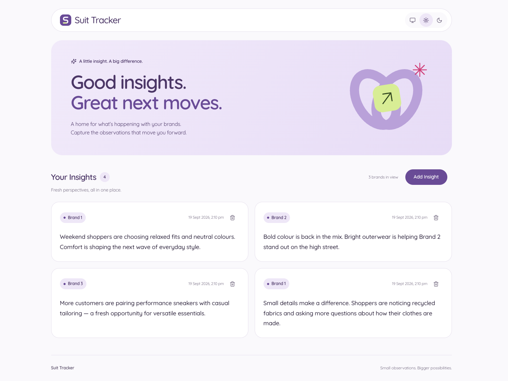
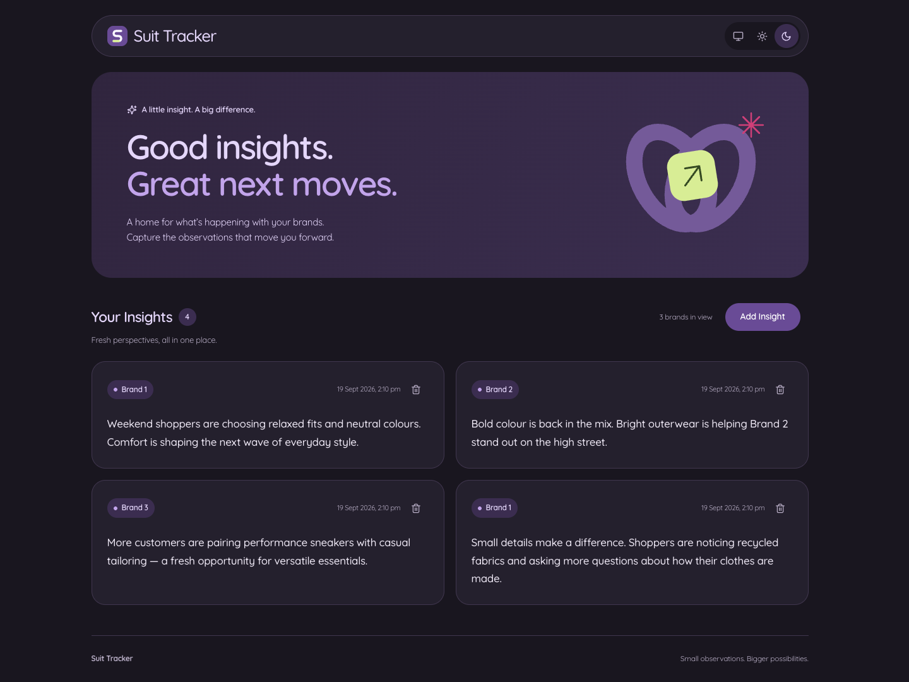
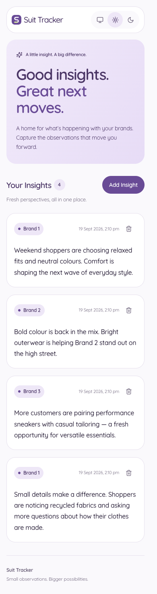
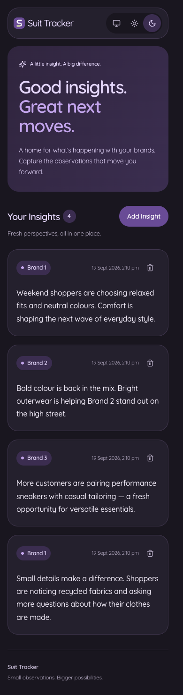
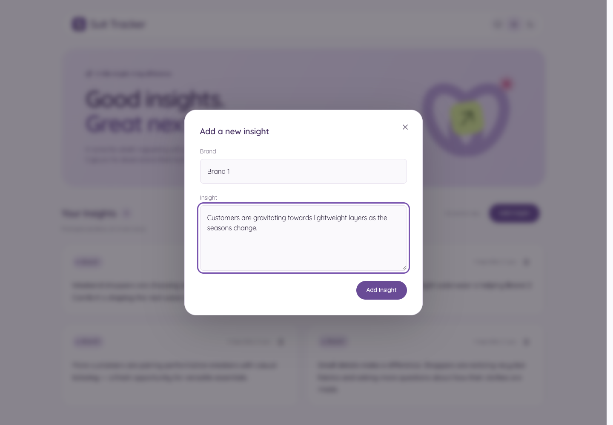
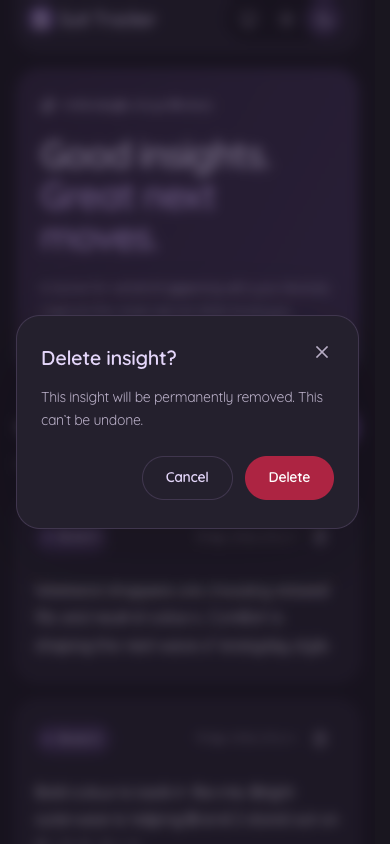

# Suit Tracker — Insights

A full-stack brand insights app built with React, TypeScript, Deno, Oak, and SQLite. Browse observations, add a new
insight for a brand, and delete an insight with confirmation.

This project completes and extends the [Tracksuit take-home starter](https://github.com/gotracksuit/ts-take-home-test).
See [Instructions.md](./Instructions.md) for the original brief.

## Implementation approach and AI assistance

I implemented the core functionality myself, including the create and delete endpoints, database operations, and
frontend integrations for loading, adding, and deleting insights.

I used GPT in the final stage to assist with deployment setup and UI updates, including visual polish, responsive
layouts, theming, and frontend performance improvements.

## Key changes and improvements

### Working insight management

- Implemented `POST /api/insights/create` and `DELETE /api/insights/:id`, backed by SQLite and connected to the UI.
- Added a dedicated `useInsights` hook for loading and mutations. Successful changes update the list without a page
  reload; initial requests are cancelled on unmount.
- Added brand selection, required-text validation, submission progress, and retryable error messages to the add form.
- Added a delete confirmation dialog and disabled actions while mutations are in progress.
- Added explicit loading, empty, and error states, plus insight and unique-brand counts.

### Backend correctness and reliability

- Added request-body and ID validation, including handling malformed JSON and missing insights.
- Used bound SQL parameters for inserts and deletes, and corrected single-insight lookup to filter by ID.
- Centralized database setup, created missing parent directories, and supported in-memory databases for tests.
- Added server tests for database setup, operations, routes, and production static-file delivery; client tests cover
  loading, creation, deletion, themes, dialogs, and shared components.
- Added GitHub Actions checks for linting and both server and client test suites.

### UI and accessibility

- Redesigned the page with a custom logo, illustrated introduction, brand badges, timestamped cards, and responsive
  layouts for desktop and mobile.
- Added **light, dark, and system themes**, with the selected preference saved in browser storage. System mode follows
  the device's colour scheme.
- Added keyboard focus styles, a skip link, labelled controls, and dialogs with focus trapping, Escape-to-close, and
  focus restoration.
- Added card and dialog transitions with reduced-motion support, plus an initial loading skeleton before React renders.

### Performance and maintainability

- Deferred animation features into a separate chunk. The current production build's initial JavaScript is approximately
  **285 kB uncompressed / 87 kB gzipped**; the animation chunk loads separately.
- Added precompressed production assets and long-lived caching for fingerprinted files, with revalidation for HTML and
  the favicon.
- Loaded fonts independently of JavaScript and preloaded the Latin subset.
- Standardized `$` import aliases across the workspace and shared their configuration with Vite and Vitest.

## Screenshots

Captured from the local production build with illustrative demo insights in a separate SQLite database. Desktop captures
use a **1440 × 1000** viewport; mobile captures use **390 × 844**. Full-page mobile images include content below the
fold. System theme uses the same light or dark appearance shown below, depending on the device setting.

### Desktop

**Light theme**



**Dark theme**



### Mobile

<!-- deno-fmt-ignore-start -->
<table>
  <tr>
    <th>Light theme</th>
    <th>Dark theme</th>
  </tr>
  <tr>
    <td></td>
    <td></td>
  </tr>
</table>
<!-- deno-fmt-ignore-end -->

### Add and delete flows

**Add an insight — desktop, light theme**



**Delete confirmation — mobile, dark theme**



## Setup

Install [Deno 2](https://docs.deno.com/runtime/getting_started/installation/). CI uses Deno 2.9.5. Nix users can run
`nix develop` using the included [flake](./flake.nix).

Run commands from the repository root. The development tasks load `.env`; configure these variables for your local
ports and SQLite location:

```dotenv
CLIENT_PORT=5173
SERVER_BASE_URL=http://localhost
SERVER_PORT=8000
DB_PATH=./data/insights.sqlite
```

A relative `DB_PATH` resolves from the server process's working directory (`server/` for `deno task dev`). The database
and its parent directory are created on first run. A new database starts with no insights; use **Add Insight** to create
one.

### Run locally

```sh
deno task dev
```

Open the client URL printed by Vite (for the example above, `http://localhost:5173`). Vite proxies `/api` requests to the
backend.

### Production build

```sh
deno task build
SERVER_PORT=8000 DB_PATH=./server/data/insights.sqlite deno task start
```

Open `http://localhost:8000`. The server serves both the API and the built client. Unlike the development tasks,
`deno task start` expects environment variables to be supplied by the shell or deployment environment.

### Checks

```sh
deno task test:server
deno task test:client
deno check .
deno lint
deno fmt --check
```

Use `deno fmt` to apply formatting.

## Implementation notes

### Import aliases

Use `$` aliases for imports between TypeScript modules. Keep component stylesheets relative to their components.

| Alias            | Location                                |
| ---------------- | --------------------------------------- |
| `$utils/`        | Shared `lib/utils/` (client and server) |
| `$components/`   | `client/src/components/`                |
| `$hooks/`        | `client/src/hooks/`                     |
| `$lib/`          | `client/src/lib/`                       |
| `$routes/`       | `client/src/routes/`                    |
| `$schemas/`      | `client/src/schemas/`                   |
| `$styles/`       | `client/src/styles/`                    |
| `$models/`       | `server/models/`                        |
| `$tables/`       | `server/tables/`                        |
| `$operations/`   | `server/operations/`                    |
| `$server-utils/` | `server/utils/`                         |

Define shared aliases in the root `deno.json` and package aliases in the relevant package's `deno.json`. Vite and Vitest
read the client and shared aliases from these configs automatically.

### Production asset delivery

`deno task build` creates gzip copies of HTML, JavaScript, and CSS alongside the original files. Deploy the entire
`client/src/dist` directory, including `.gz` files. The application server negotiates gzip automatically and falls back
to uncompressed files when needed. Fingerprinted assets are cached for a year; HTML and the favicon revalidate so
deployments remain discoverable.

Animation features load separately after the app starts rendering. The development server does not represent production
compression or caching; use the built app served by `deno task start` when measuring download performance.
